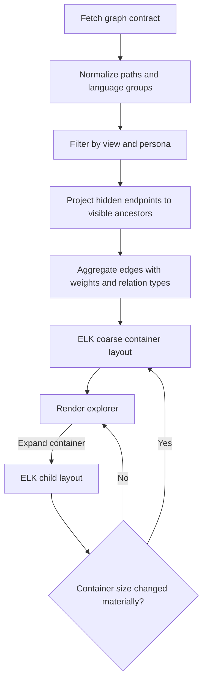
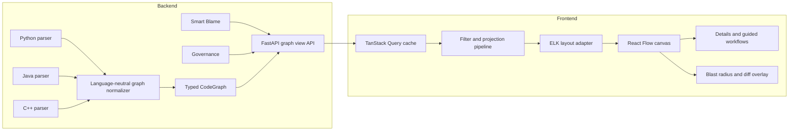

# Synapse Frontend Integration Architecture Plan

> Verified against the repository on 2026-06-21. This plan uses Understand-Anything (UA) as a UX reference, but keeps Synapse's existing product strengths and current Python/FastAPI architecture.

## 1. Goal and Product Direction

Revamp Synapse's graph experience into a scalable, guided codebase explorer while preserving the workflows that distinguish the product:

- dependency and blast-radius analysis;
- Smart Blame and knowledge-risk signals;
- architecture governance and drift;
- GraphRAG-assisted codebase questions;
- repository ingestion from GitHub or ZIP;
- parsing of Python, Java, and C++ repositories.

The target is not a wholesale clone of UA or a forced single-page replacement for every Synapse screen. The graph explorer should become the common visual workspace, with contextual entry points into the existing Blast Radius, Smart Blame, Governance, and Mentor workflows. Dedicated routes remain useful for deep analysis and should continue to live inside the existing `AppShell`.

## 2. Verified Current State

### Backend and parser

- FastAPI serves the graph and analysis APIs from `backend/api/main.py`.
- `GET /graph` returns entity nodes and dependency edges.
- `GET /graph/condensed` already returns a three-level hierarchy: directories, files, and entities. It also pre-aggregates file and directory edges with weights.
- `GET /blast-radius/{function_name}` and its explanation endpoint provide impact data that can be projected onto the graph.
- Repository ingestion calls the language-agnostic `scan_repository()` entry point and rebuilds `repo_graph.json` plus the in-memory `CodeGraph`.
- `parse_file()` dispatches by extension:
  - Python: `.py`
  - Java: `.java`
  - C++: `.cpp`, `.cc`, `.cxx`, `.h`, `.hpp`
- All parsers map their results into the shared dataclasses in `backend/parsing/entities.py` and calculate cyclomatic/cognitive complexity.
- Java extraction includes packages, imports, classes, interfaces, enums, fields, methods/constructors, visibility, declared exceptions, inheritance, implementations, and calls.
- C++ extraction includes functions, classes/structs, namespaces, include directives, methods, calls, and complexity.

### Frontend

- React 19, TypeScript, Vite, React Router, TanStack Query, Framer Motion, Tailwind CSS, and React Flow v12 are already in use.
- `lucide-react` and `@xyflow/react` are already installed; they are not new dependencies.
- `BlastRadiusGraph.tsx` already supports hierarchy and full-graph modes, custom directory/file/entity nodes, expansion, focus isolation, and edge projection to the currently visible ancestor.
- The hierarchy layout still uses fixed grid coordinates. Expansion does not resize containers or reflow neighboring nodes.
- Projected edges are deduplicated visually, but their weights are not displayed and the backend's `directory_edges`/`file_edges` aggregates are not fully used by the canvas.
- The UI has separate routes for Dashboard, Blast Radius, Smart Blame, Governance, and Mentor. There is no unified codebase explorer, guided tour, diff overlay, domain view, or persona mode yet.
- API calls and query caching are already centralized in `frontend/src/lib/api.ts` and `frontend/src/lib/hooks.ts`. A second global store should only be added if interaction state becomes too complex for local state and TanStack Query.

### Gaps that affect the revamp

These should be resolved before treating the graph contract as language-neutral:

1. C++ `ParsedFile` instances currently use the dataclass's default `language="python"`; the C++ parser must explicitly set `language="cpp"` on success and failure.
2. `backend/parsing/__init__.py` exports the Java parser and metrics but not the C++ equivalents.
3. `get_all_entities()` intentionally exports only functions and classes. Modules, imports, and variables are lost before graph construction, so the current graph cannot faithfully represent packages, headers, configuration, fields, or explicit import/include relationships.
4. Dependency construction resolves calls primarily by unqualified name. Overloads, same-named methods, Java packages, C++ namespaces, and header/source pairs can resolve ambiguously.
5. The graph edges returned by `GET /graph` do not expose relationship type, even though the graph model distinguishes relationships such as calls and inheritance.
6. Parser-specific automated tests are absent. The UI revamp must not assume Java/C++ parity until fixtures and contract tests establish it.

## 3. Target Experience

### 3.1 Unified explorer

Add a new `/explorer` route inside `AppShell`. It should provide:

- a React Flow canvas with directory/package/namespace containers;
- search and filters for language, entity type, risk, ownership, and governance layer;
- structural and domain views;
- a detail drawer for source metadata, complexity, ownership, violations, and AI explanations;
- an impact mode that overlays blast-radius or changed-file results;
- optional guided tours through important call paths;
- deep links to the existing specialized pages.

The first release should prioritize structural exploration and impact overlays. Domain clustering, personas, and generated tours are later enhancements because they require richer semantics and validation.

### 3.2 Progressive graph disclosure

The graph must remain useful on medium and large repositories:

1. Render top-level containers first.
2. Aggregate cross-container edges and show their dependency counts.
3. Lay out children only when a container is expanded.
4. Recompute the coarse layout when an expanded container's measured size changes materially.
5. Virtualize or cap entity rendering when a container contains too many nodes, with search as an escape hatch.
6. Run expensive layout/community work off the main thread when profiling shows UI stalls.



### 3.3 Edge aggregation and portals

- Use the existing directory/file aggregation from `/graph/condensed` as the baseline rather than recomputing every aggregate in React.
- Preserve `weight` and relationship-type counts so edge width, labels, and filters convey meaning.
- When endpoints are hidden, project them to their nearest visible ancestor and combine identical projected edges.
- Introduce portal nodes only for cross-layer navigation when a direct aggregate edge is still visually disruptive. Portals are a UX strategy, not a backend entity.
- Selecting an aggregate edge should reveal its constituent dependencies in the detail drawer.

### 3.4 Language-aware presentation

The frontend contract must carry `language` and language-specific metadata without forcing every language into Python terminology.

| Concept | Python | Java | C++ |
| :--- | :--- | :--- | :--- |
| Top-level grouping | module/package | package | namespace/directory |
| Type entities | class | class/interface/enum | class/struct |
| Dependency syntax | import/from | import/static import | include/import |
| Callable identity | qualified function/method | package + class + signature | namespace + class + signature |
| Special metadata | decorators, async | visibility, throws, implements | header/source, overload, template/namespace |

Filters, badges, tooltips, and tours should use these terms. Stable IDs must include a normalized repository-relative path plus a qualified symbol and, where needed, a signature discriminator.

## 4. Target Architecture and Contract



### 4.1 Evolve the existing endpoint

Prefer a versioned `GET /graph/explorer` (or an additive evolution of `/graph/condensed`) over creating another loosely defined "unified" payload. Keep `/graph` and `/graph/condensed` stable during migration.

Minimum response shape:

```ts
interface ExplorerGraphResponse {
  schema_version: 1;
  repository: { id: string; name: string; root_label: string };
  nodes: ExplorerNode[];
  edges: ExplorerEdge[];
  groups: ExplorerGroup[];
  capabilities: {
    languages: Array<'python' | 'java' | 'cpp'>;
    has_git: boolean;
    has_governance: boolean;
    has_summaries: boolean;
  };
}

interface ExplorerNode {
  id: string;
  kind: 'directory' | 'file' | 'module' | 'class' | 'interface' |
        'enum' | 'struct' | 'function' | 'method' | 'variable';
  language: 'python' | 'java' | 'cpp';
  name: string;
  qualified_name: string;
  file_path: string;
  range?: { start: number; end: number };
  parent_id?: string;
  complexity?: { cyclomatic: number; cognitive: number; lines_of_code: number };
  risk?: { level: 'LOW' | 'MEDIUM' | 'HIGH' | 'CRITICAL'; score?: number };
  metadata: Record<string, unknown>;
}

interface ExplorerEdge {
  id: string;
  source: string;
  target: string;
  relation: 'contains' | 'imports' | 'includes' | 'calls' |
            'inherits' | 'implements';
  weight: number;
  members?: string[];
}
```

Do not generate LLM summaries synchronously in this endpoint. Return cached summaries when available and a deterministic fallback derived from symbol/type/path otherwise.

### 4.2 Frontend modules

```text
frontend/src/features/explorer/
├── api/                  query hooks and contract adapters
├── components/           toolbar, canvas, drawer, tour controls
├── graph/                projection, aggregation, filtering
├── layout/               ELK adapters and layout worker
├── nodes/                directory, file, entity, portal nodes
├── overlays/             blast radius, diff, governance, ownership
├── state/                interaction state only if local state is insufficient
└── types.ts
```

Reuse the existing blast-radius node components where their visual contract fits. Extract shared graph primitives before replacing `BlastRadiusGraph.tsx`; keep the old route operational until the explorer reaches feature parity.

### 4.3 Dependencies

Required for the first implementation:

- `elkjs` for hierarchical layout.

Evaluate only when their feature phase begins:

- `graphology` and `graphology-communities-louvain` for domain clustering;
- `d3-force` only if domain view needs a force-directed refinement;
- a small worker bridge (or native `Worker`) if ELK blocks interaction at target graph sizes.

Do not reinstall `@xyflow/react` or `lucide-react`; both already exist. Do not add Zustand by default. TanStack Query owns server state, while expansion, selection, filters, and active overlays can begin as reducer/context state scoped to the explorer.

## 5. Delivery Roadmap

### Phase 0: Parser and contract correctness

1. Correct and export C++ language metadata.
2. Add Python, Java, and C++ parser fixtures and tests for identity, entities, complexity, imports/includes, calls, inheritance, and malformed input.
3. Define stable qualified IDs and repository-relative paths.
4. Preserve modules/imports/variables or convert them into typed nodes/edges during normalization.
5. Add relationship types to serialized graph edges and improve ambiguous Java/C++ call resolution incrementally.

**Exit criteria:** the same fixture repository produces deterministic IDs and a validated, typed graph after repeated ingestion; every node reports the correct language.

### Phase 1: Explorer API

1. Add Pydantic response models and `schema_version`.
2. Implement `GET /graph/explorer` using existing graph and condensed-hierarchy helpers.
3. Attach risk, governance layer, and ownership metadata in bounded batches.
4. Add query parameters for language, kind, group, and maximum detail level if payload profiling warrants server-side filtering.
5. Keep legacy endpoints unchanged and add contract tests for all three languages.

**Exit criteria:** API tests validate referential integrity, typed relationships, aggregate weights, stable IDs, and empty/error states.

### Phase 2: Structural explorer MVP

1. Add `/explorer`, navigation, typed API client, and query hook.
2. Implement deterministic directory/file grouping and structural filters.
3. Add async ELK coarse layout and lazy child layout.
4. Render weighted aggregate edges and expansion/reflow behavior.
5. Add search, selection, keyboard focus, loading/error/empty states, and a details drawer.

**Exit criteria:** users can ingest Python, Java, or C++ fixtures, find a symbol, expand its hierarchy, inspect metadata, and navigate the graph without overlapping containers or nondeterministic jitter.

### Phase 3: Synapse workflow overlays

1. Connect the existing blast-radius endpoint and highlight affected nodes/paths on the explorer.
2. Add governance violation and layer overlays.
3. Add Smart Blame ownership and knowledge-risk overlays.
4. Link the drawer to Mentor explanations without blocking normal graph interaction.
5. Add a diff input contract (working tree, commit range, or uploaded patch) before implementing a diff overlay; do not infer changed files solely in the browser.

**Exit criteria:** overlays can be enabled independently, have legends, remain understandable on collapsed graphs, and deep-link to specialized screens.

### Phase 4: Guided and adaptive experiences

1. Implement deterministic tours from known graph paths first; add generated summaries only after the interaction is proven.
2. Auto-expand ancestors and call `fitView` for each tour step.
3. Add domain clustering behind a feature flag and evaluate cluster quality on representative repositories.
4. Add persona presets as transparent filter/detail presets:
   - learner: simplified entities plus explanations;
   - engineer: full structural and impact detail;
   - manager: modules, ownership, risk, and governance.
5. Persist shareable explorer state in URL parameters where practical.

**Exit criteria:** tours are resumable and keyboard accessible; persona switches never hide active selections without explanation; domain clusters are stable enough to label and navigate.

### Phase 5: Performance and polish

1. Profile ingestion payload size, layout time, interaction latency, and memory use.
2. Move ELK/community calculation to a worker when thresholds are exceeded.
3. Add node caps, progressive loading, and cancellation for stale layout runs.
4. Polish reflow/zoom animation, reduced-motion behavior, responsive panels, and accessible contrast.

Suggested initial budgets, to be validated with real repositories:

- coarse graph visible within 2 seconds after API data is available for 5,000 entities;
- layout work never blocks the main thread for more than 100 ms continuously;
- pan/zoom remains near 50-60 fps under the normal collapsed view;
- no more than 500 detailed nodes rendered simultaneously without an explicit user action.

## 6. Verification Plan

### Automated backend verification

```bash
pytest backend/tests -q
```

Add coverage for:

- parser dispatch for every supported extension;
- correct `language` values for Python, Java, and C++;
- Java interface/enum/implements and C++ namespace/struct/include fixtures;
- stable qualified IDs and overload/name-collision behavior;
- explorer schema validation and dangling-edge rejection;
- aggregate edge weights and relationship types;
- ingestion status and graph rebuild behavior.

### Automated frontend verification

```bash
cd frontend
npm run test:run
npm run build
npm run lint
```

Add unit tests for filtering, visible-ancestor projection, aggregation, layout conversion, and overlay composition. Add component tests for expansion, selection, search, language badges, drawer content, and error states. Use browser-level tests for tour navigation and reflow because coordinate behavior is not sufficiently covered by DOM-only tests.

### Manual scenarios

1. Ingest one representative Python, Java, and C++ repository.
2. Confirm packages/namespaces, files, types, and call/inheritance/include edges use the correct language labels.
3. Expand and collapse large containers; verify neighbors reflow and the viewport remains stable.
4. Select a weighted aggregate edge and inspect its constituent dependencies.
5. Run blast-radius analysis and verify highlighting survives collapse/expand transitions.
6. Toggle governance and ownership overlays independently.
7. Navigate a tour with mouse and keyboard, including reduced-motion mode.
8. Reload a copied explorer URL and verify the selected view/filter state is restored.

## 7. Risks and Decisions

| Risk | Mitigation |
| :--- | :--- |
| Ambiguous Java/C++ symbol resolution makes impact paths misleading | Use qualified IDs, retain unresolved edges explicitly, and show confidence/source metadata. |
| Large payloads and layouts freeze the UI | Progressive detail, server filters, aggregation, cancellation, workers, and render caps. |
| A single dashboard becomes crowded | Use the explorer as a shared workspace while retaining focused feature routes. |
| LLM-generated tours or summaries are slow/inconsistent | Cache them, provide deterministic fallbacks, and keep them off the critical render path. |
| Persona modes hide important technical risk | Implement them as visible presets with clear active filters, not separate data models. |
| Frontend and backend contracts drift | Version the schema, validate with Pydantic and TypeScript fixtures, and add contract tests. |

## 8. Recommended First Milestone

The first shippable milestone is **parser correctness plus the structural explorer MVP** (Phases 0-2). It delivers immediate UI/UX value, uses Synapse's existing hierarchy endpoint and React Flow investment, and establishes a trustworthy multilingual graph foundation before adding domain clustering, generated tours, portals, or persona adaptation.
